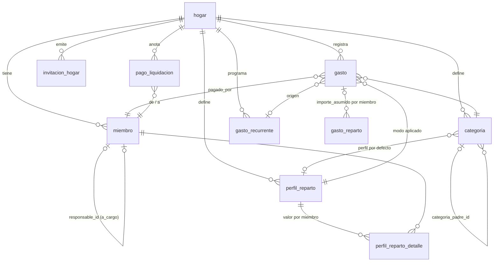

# Modelo de datos

PostgreSQL (Supabase). **La fuente de verdad es `supabase/migrations/*.sql`**; este documento es un mapa para orientarse. EF Core solo mapea (`MiParteDbContext`). Todas las tablas cuelgan de `hogar` (`hogar_id`) con RLS y filtro global por hogar en el servicio.

## Tablas

| Tabla | Contenido y reglas |
|---|---|
| `hogar` | Nombre. Al crearlo (`crear_hogar`) se siembran 4 perfiles y 6 categorías y el creador entra como admin y adulto. |
| `miembro` | `tipo` `adulto` \| `a_cargo`; un `a_cargo` **exige** `responsable_id` y un adulto no lo tiene. `user_id` enlaza con `auth.users` (puede ser nulo: p. ej. el hijo). `rol` (admin/miembro), `activo`. Siempre queda un admin activo y vinculado. |
| `perfil_reparto` | `modo`: `porcentaje`, `partes`, `cuenta_comun` (lo asume la cuenta común) o `individual`. Nombre único por hogar. |
| `perfil_reparto_detalle` | Valor (% o partes) por miembro y perfil. No se usa en `cuenta_comun` ni en `individual`. |
| `categoria` | Jerárquica (`categoria_padre_id`) con perfil de reparto por defecto. |
| `gasto` | Fecha, `importe > 0` con 2 decimales, categoría, `pagado_por`, perfil aplicado, concepto, `gasto_recurrente_id` de origen, `a_cargo_cuenta_comun` (sin filas en `gasto_reparto`, fuera de la liquidación). |
| `gasto_reparto` | **Resultado del reparto congelado al crear el gasto**: `importe_asumido` por miembro. No se recalcula salvo con `PUT` del gasto. En los gastos repartidos, la suma de las filas = importe del gasto; los `a_cargo_cuenta_comun` no tienen filas. |
| `gasto_recurrente` | Plantilla mensual, `dia_mes` 1-28, `activo`. Índice único evita duplicar la generación de un mes (idempotente). |
| `invitacion_hogar` | Solo se guarda el **hash SHA-256** del token; caduca a 7 días; un solo uso (`usada_en`/`usada_por`). |
| `pago_liquidacion` | Transferencia real `de_miembro_id` → `a_miembro_id` en un `mes` (primer día del mes) para saldar la liquidación. |
| ~~`ingreso`~~ | **Eliminada** por `20261007000000_perfiles_cuenta_comun_sin_ingresos.sql`: el diseño no guarda ingresos. |

## Invariantes que no se rompen
- Claves foráneas compuestas `(hogar_id, id)`: un registro nunca referencia datos de otro hogar.
- Importes `numeric(12,2)`; en código `decimal`, nunca `float`. El último miembro absorbe el céntimo sobrante para que el reparto sume el importe.
- Pagador y reparto solo para **adultos activos**; los `a_cargo` no pagan ni reparten.
- Cambiar partes o perfiles solo afecta a gastos **nuevos**.

## Pendiente de modelar (ver diseño)
Cuenta común (aportaciones mensuales por adulto, saldo y reembolsos; el gasto «a cargo de la cuenta» ya está modelado), cierre de mes, gastos personales fuera de liquidación, etiquetas, historial de cambios. Cada uno requerirá una migración SQL nueva y su mapeo en `MiParteDbContext`.
