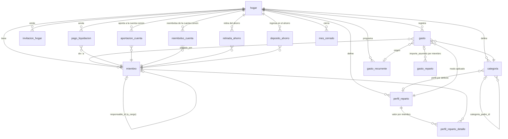

# Modelo de datos

PostgreSQL (Supabase). **La fuente de verdad es `supabase/migrations/*.sql`**; este documento es un mapa para orientarse. EF Core solo mapea (`MiParteDbContext`). Todas las tablas cuelgan de `hogar` (`hogar_id`) con RLS y filtro global por hogar en el servicio.

**Escritura solo por Core.Api** (migración `20261011000000_cerrar_escritura_directa.sql`): `anon` y `authenticated` solo conservan `SELECT` (acotado por RLS; `anon` ni eso) y no pueden insertar, actualizar ni borrar, porque la anon key es pública y permitiría saltarse las validaciones de la API vía PostgREST. Las RPC `crear_hogar` y `aceptar_invitacion` ya no son ejecutables por `authenticated` (Core.Api las replica con sus topes). Las tablas llevan además `check` de longitud (nombres ≤ 100, conceptos ≤ 200). El rol de conexión de Core.Api debe ser propietario (`postgres`), nunca `authenticated`.

## Tablas

| Tabla | Contenido y reglas |
|---|---|
| `hogar` | Nombre. Al crearlo (`crear_hogar`) se siembran 4 perfiles y 6 categorías y el creador entra como admin y adulto. |
| `miembro` | `tipo` `adulto` \| `a_cargo`; un `a_cargo` **exige** `responsable_id` y un adulto no lo tiene. `user_id` enlaza con `auth.users` (puede ser nulo: p. ej. el hijo). `rol` (admin/miembro), `activo`. Siempre queda un admin activo y vinculado. |
| `perfil_reparto` | `modo`: `porcentaje`, `partes`, `cuenta_comun` (lo asume la cuenta común) o `individual`. Nombre único por hogar. |
| `perfil_reparto_detalle` | Valor (% o partes) por miembro y perfil. No se usa en `cuenta_comun` ni en `individual`. |
| `categoria` | Jerárquica (`categoria_padre_id`) con perfil de reparto por defecto. |
| `gasto` | Fecha, `importe > 0` con 2 decimales, categoría, `pagado_por` (nulo = lo paga directamente la cuenta común; exige `a_cargo_cuenta_comun`), `pagado_desde_ahorro` (se descuenta del ahorro en vez del saldo de gastos; exige `pagado_por` nulo y `a_cargo_cuenta_comun`), perfil aplicado, concepto, `gasto_recurrente_id` de origen, `a_cargo_cuenta_comun` (sin filas en `gasto_reparto`, fuera de la liquidación). |
| `gasto_reparto` | **Resultado del reparto congelado al crear el gasto**: `importe_asumido` por miembro. No se recalcula salvo con `PUT` del gasto. La suma de las filas = importe del gasto. |
| `gasto_recurrente` | Plantilla mensual, `dia_mes` 1-28, `activo`. Índice único evita duplicar la generación de un mes (idempotente). |
| `invitacion_hogar` | Solo se guarda el **hash SHA-256** del token; caduca a 7 días; un solo uso (`usada_en`/`usada_por`). |
| `pago_liquidacion` | Transferencia real `de_miembro_id` → `a_miembro_id` en un `mes` (primer día del mes) para saldar la liquidación. |
| `auditoria` | Historial **de solo añadir** (un trigger rechaza `UPDATE`, `DELETE` y `TRUNCATE`, también al propietario; solo se permite el borrado en cascada al eliminar el hogar). `usuario_id` sin FK (el rastro sobrevive a la cuenta), `accion`, `entidad`, `entidad_id`, `antes`/`despues` en `jsonb`. La escribe solo Core.Api, dentro de la transacción del cambio; la lee un admin vía RLS (`es_admin_hogar`). |
| `aportacion_cuenta` | Importe fijo mensual de un adulto a la cuenta común, vigente `desde` un mes (día 1); único por miembro y mes. El importe de un mes es el de la fila más reciente que no lo supere; 0 = deja de aportar. `ahorro` (0 ≤ ahorro ≤ importe, por `check`) es la parte que se aparta para ahorro; el resto queda para gastos. |
| `reembolso_cuenta` | Pago de la cuenta común a un miembro por gastos que adelantó (`gasto.a_cargo_cuenta_comun`). Baja lo pendiente y el efectivo, no el saldo. |
| `deposito_ahorro` | Dinero que entra al ahorro de la cuenta común fuera de la aportación mensual (ahorro inicial, lotería...; `importe > 0`, concepto opcional). Suma al ahorro disponible, no toca el saldo de gastos. Solo lectura para los roles de cliente. |
| `mes_cerrado` | Mes cerrado por un miembro (`mes` = día 1, único por hogar; `cerrado_por` = usuario sin FK). Mientras exista la fila no se pueden crear, editar ni borrar gastos con fecha en ese mes ni generar recurrentes en él; reabrir = borrar la fila. Solo lectura para los roles de cliente: escribe Core.Api, que deja cerrar a cualquier miembro y reabrir solo a un admin. |
| `retirada_ahorro` | Dinero que el hogar saca del ahorro de la cuenta común (`importe > 0`, concepto opcional). Baja el ahorro disponible, no el saldo de gastos. Core.Api impide retirar más de lo ahorrado. Solo lectura para los roles de cliente. |
| ~~`ingreso`~~ | **Eliminada** por `20261007000000_perfiles_cuenta_comun_sin_ingresos.sql`: el diseño no guarda ingresos. |

## Invariantes que no se rompen
- Claves foráneas compuestas `(hogar_id, id)`: un registro nunca referencia datos de otro hogar.
- Importes `numeric(12,2)`; en código `decimal`, nunca `float`. El último miembro absorbe el céntimo sobrante para que el reparto sume el importe.
- Pagador y reparto solo para **adultos activos**; los `a_cargo` no pagan ni reparten.
- Cambiar partes o perfiles solo afecta a gastos **nuevos**.

## Pendiente de modelar (ver diseño)
Activar la cuenta común por hogar (hoy está activa si hay aportaciones), «su parte» por persona en el resumen, gastos personales fuera de liquidación, etiquetas, historial de cambios. Cada uno requerirá una migración SQL nueva y su mapeo en `MiParteDbContext`.
